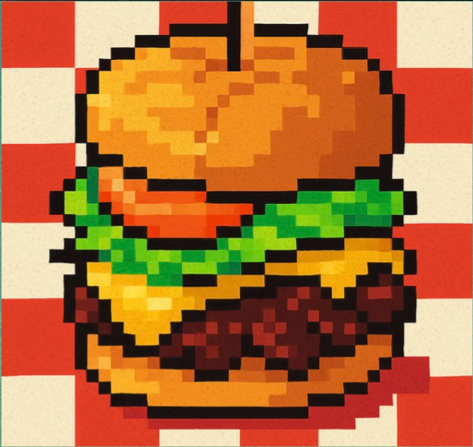
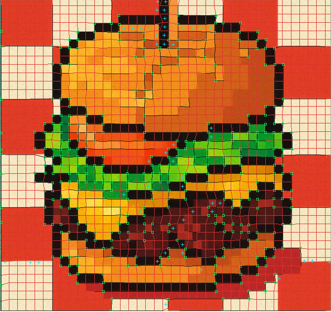
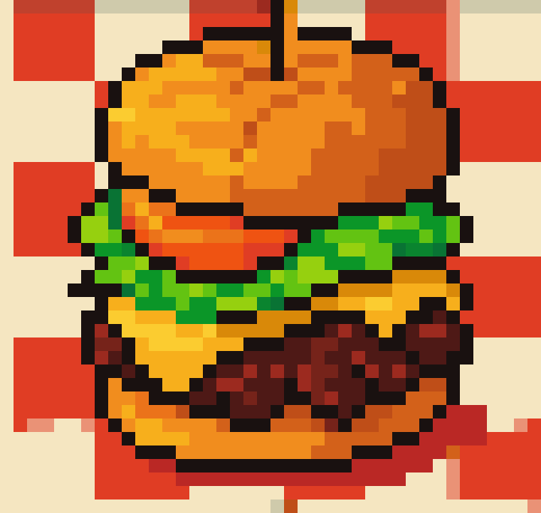
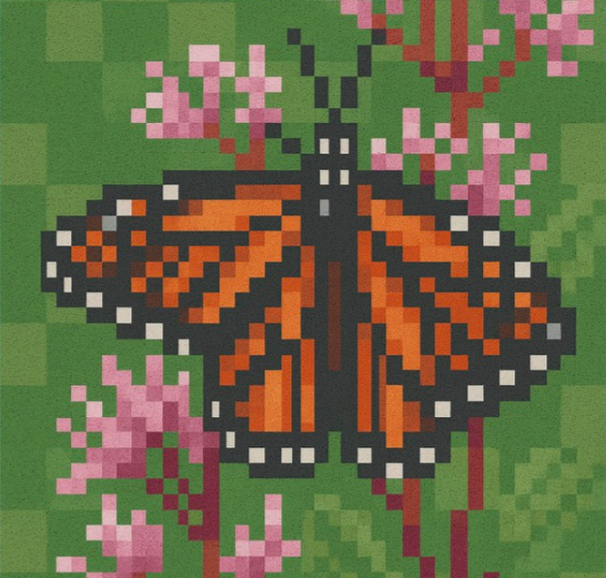
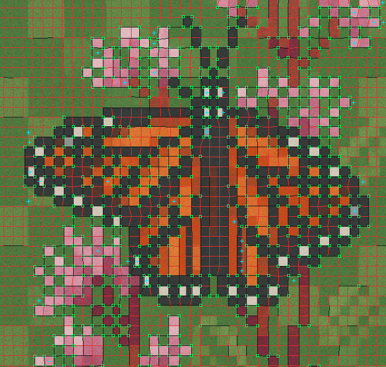
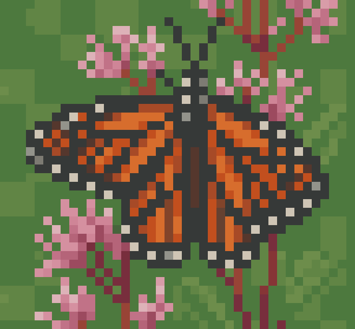
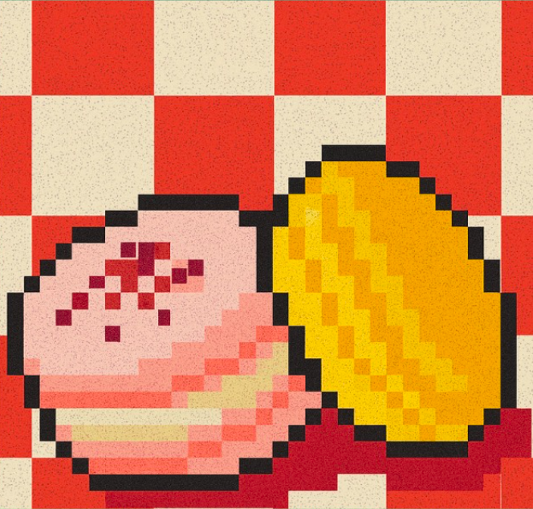
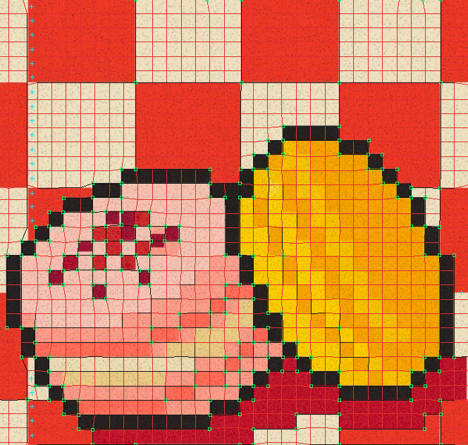
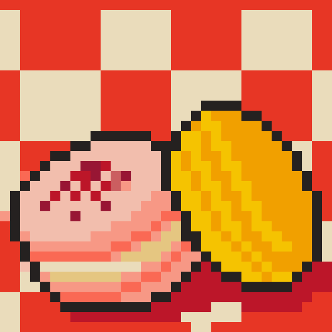

# Pixel Pusher

Pixel Pusher is an experimental Rust CLI for recovering clean, grid-aligned pixel art from AI-generated approximations, rescaled artwork, and imperfect captures.

It searches logical-pixel widths, heights, and grid phases independently, including fractional source-pixel dimensions and offsets. Cells can therefore fit a source that has been slightly squeezed or stretched along one axis—for example, a `4.12 × 3.84` source grid. Each candidate is scored by the color variance *inside* its cells. A configurable inset excludes anti-aliased or misaligned borders from both scoring and final color estimation. Auto mode generates several edge-aware palette candidates in Oklab, then balances reconstruction error against palette complexity.

The output is always rendered onto a new, rigid lattice of exact square pixels. Fractional squeeze, perspective correction, and optional non-uniform source-lattice fitting affect source sampling only; they never produce subpixels or irregular boundaries in the result.

## Examples

Each row shows the source image, Pixel Pusher's edge detection and fitted lattice, and the reconstructed square-pixel output. In the diagnostic view, red is the complete mesh, dark segments are locally supported boundaries, green squares are high-confidence corner anchors, and cyan crosses mark color-sampling overrides.

<table>
  <thead>
    <tr>
      <th>Input</th>
      <th>Edge detection + lattice fit</th>
      <th>Output</th>
    </tr>
  </thead>
  <tbody>
    <tr>
      <td></td>
      <td></td>
      <td></td>
    </tr>
    <tr>
      <td colspan="3"><sub>Hamburger — recovered source grid: 17.3 × 17.0 px; rigid output grid: 17 px.</sub></td>
    </tr>
    <tr>
      <td></td>
      <td></td>
      <td></td>
    </tr>
    <tr>
      <td colspan="3"><sub>Butterfly — recovered source grid: 16.8 × 17.0 px; rigid output grid: 17 px.</sub></td>
    </tr>
    <tr>
      <td></td>
      <td></td>
      <td></td>
    </tr>
    <tr>
      <td colspan="3"><sub>Pastry and lemon — recovered source grid: 20.4 × 20.3 px; rigid output grid: 20 px.</sub></td>
    </tr>
  </tbody>
</table>

## Features

- Automatic logical-pixel scale, x/y phase, fractional squeeze, clustered-line lattice initialization, edge-gated local fitting, palette, and output-scale selection
- Independent source cell width and height with square output reconstruction
- Fractional-area RGB/RGB² sampling through summed-area tables
- Edge-aware, histogram-peak-seeded, hue-preserving Oklab palette candidates with automatic color-count selection
- Optional hard palette limit and flexible threshold-clustering fallback
- Compact indexed-color PNG output using 1, 2, 4, or 8 bits per pixel
- One-cell color-ramp suppression with source-fidelity protection
- Optional four-corner perspective rectification for photographed art
- Optional edge-weighted non-uniform lattice fitting for globally inconsistent source alignment
- Perceptual output metrics for edge strength, weak transitions, and crispness
- PNG, JPEG, and WebP input
- Native drag-and-drop desktop app with OS file dialogs and four-corner editing

## Install

Pixel Pusher requires a current stable Rust toolchain.

### Homebrew

```sh
brew tap wjhrdy/pixel-pusher https://github.com/wjhrdy/pixel-pusher
brew install pixel-pusher
```

This installs both `pixel-pusher` and the native `pixel-pusher-gui` desktop executable.

### Prebuilt binaries

Release archives for Linux, macOS, and Windows are available from the [GitHub releases page](https://github.com/wjhrdy/pixel-pusher/releases). Each archive is accompanied by a SHA-256 checksum.

### Build from source

```sh
git clone https://github.com/wjhrdy/pixel-pusher.git
cd pixel-pusher
cargo build --release
```

The executables will be at `target/release/pixel-pusher` and `target/release/pixel-pusher-gui`. You can also install both into Cargo's binary directory:

```sh
cargo install --path .
```

## Quick start

```sh
pixel-pusher input.png --auto
```

### Native desktop app

Pixel Pusher includes a native Rust desktop application—there is no local server, embedded browser, or web runtime:

```sh
pixel-pusher --gui
# or launch the dedicated executable
pixel-pusher-gui
```

Drop in a PNG, JPEG, or WebP image, then save the corrected indexed PNG, detected-grid overlay, or JSON report through the operating system's file dialog. Auto mode deliberately has no configuration: it selects the regular grid, squeeze, edge-gated local lattice, palette, and output scale from built-in defaults. Choose Custom to expose the palette, grid, sampling, lattice, edge, forced-cell, and perspective controls. Untouched Custom mode continues to use the exact Auto pipeline; explicit Custom processing begins only after a control changes, and Reset defaults returns to the Auto baseline. You can open an image immediately with `pixel-pusher-gui input.png` or `pixel-pusher input.png --gui`.

After processing, the input preview switches to the detected-grid visualization. The complete fitted mesh is red; dark segments identify locally supported boundaries, green squares mark high-confidence corner anchors with both horizontal and vertical evidence, and cyan crosses mark cells whose final palette choice differs from regular-grid sampling. Toggle back to the original whenever you want to adjust perspective corners. The corrected square-pixel output remains visible directly below the input in the same scrollable workspace. All three previews render at 100% stored-pixel dimensions with nearest sampling; oversized images scroll instead of being fit or rescaled.

For a rotated photograph or perspective-skewed capture, enable **Correct perspective** and drag the numbered handles to the source artwork's top-left, top-right, bottom-right, and bottom-left corners. Perspective rectification and source-lattice fitting only alter sampling. The downloaded image remains a rigid lattice of square pixels.

The native window and file dialogs work on macOS, Windows, and Linux. Processing runs in a background thread on the same computer, and the existing command-line interface remains available for scripts and batch jobs.

Every processing control includes an inline `i` badge. Hover it for a plain-language explanation of the setting, its default or conservative behavior, and the range that is normally useful.

Auto mode selects the fundamental logical-pixel scale using both cell-interior consistency and periodic concentration of source gradients on candidate grid boundaries. It searches source-cell dimensions from 2 through 32 pixels by default, treats `--min-block` and `--max-block` as hard bounds, and uses a mild square-cell prior to reject near-tied false squeeze while retaining clearly supported rectangular fits. It then refines fractional width, height, and phase, fits the local lattice with scale-derived radius and step settings, compacts the palette, and renders an unsqueezed square-cell output. Only the input path and `--auto` are required.

The command writes three files next to the input:

- `input.corrected.png` — reconstructed pixel art as a lossless indexed-color PNG
- `input.corrected.grid.png` — detected grid over the source
- `input.corrected.report.json` — selected grid, palette, output-contrast metrics, settings, and ranked block-size candidates

Useful controls:

```sh
# Search a wider range and force no more than 24 colors
pixel-pusher input.png --auto --min-block 3 --max-block 32 --max-colors 24

# Use smart palette selection with a manually constrained grid
pixel-pusher input.png --block 8 --smart-palette

# Ignore more of each logical pixel's contaminated border
pixel-pusher input.png --inset 0.22

# Inspect a particular square block size while still optimizing its sub-pixel phase
pixel-pusher input.png --block 8

# Force rectangular logical pixels
pixel-pusher input.png --block-width 7 --block-height 9

# Paint each recovered logical cell as an exact 6 × 6 output square
pixel-pusher input.png --output-block 6
```

Run `pixel-pusher --help` for every option.

A typical automatic run reports the selected source geometry and final-image measurements:

```text
source grid: 3.200 × 3.800 px, phase (2.55, 1.30)
square output grid: 3 px, dimensions 1569 × 747
fit score: 0.079981, palette: 8 colors
palette selection: fixed (14 histogram peaks, fixed candidates 2..=12)
output contrast: mean 0.043356, RMS 0.097066, strong edges 14.01%, weak transitions 49.91%, crispness 0.031726
```

## How the search works

1. Build summed-area tables for RGB and RGB².
2. Coarsely test every integer phase for every requested width × height pair.
3. Refine the strongest candidates' phase and source width/height fractionally.
4. Select the grid with the lowest normalized within-cell variance, with a small preference for larger cells to resolve exact divisor ties.
5. Estimate one color per logical cell from only its inset interior.
6. Build edge-weighted, histogram-peak-seeded Oklab k-means candidates for palette sizes 2 through 12, emphasizing chroma separation so small hue families remain represented.
7. Score their reconstruction error and complexity, then choose a fixed candidate or a flexible threshold-clustered palette.
8. Penalize one-cell intermediate-color ramps whose opposite neighbors are high contrast, while retaining a sampled-color fidelity cost.
9. Paint every recovered cell onto a separate, perfectly square output lattice.

The report measures the final logical-pixel lattice in perceptual Oklab space. It includes mean and RMS neighbor distance, strong-edge density, the share of changed boundaries that remain weak, and a soft-thresholded crispness score. These measurements do not depend on output enlargement. Read crispness together with edge density: maximizing contrast alone can reward unwanted random noise.

### Smart palette selection

Smart selection is enabled by `--auto`, or independently with `--smart-palette`. It builds a 16-bin-per-RGB-channel histogram of recovered cell colors, gives extra weight to cells on strong logical-pixel edges, finds radius-one local peaks, and uses the strongest peaks to seed deterministic weighted k-means candidates. Candidate sizes default to 2 through 12. Each candidate records weighted Oklab SSE, `log10(SSE + 1)`, a per-color complexity penalty, normalized fit, and its smallest cluster fraction in the JSON report.

The lowest rate-distortion cost wins. By default, the complexity penalty adapts to the quantized histogram: peak-rich images retain larger palettes, while simple images still compact aggressively. If the fit curve is still improving at the end of a peak-rich candidate bank, a flexible threshold-clustered palette may use up to 24 colors by default. Tune the fixed bank with `--palette-candidate-max`, override the adaptive tradeoff with `--palette-penalty` (`0` retains the best-fitting candidate; larger values produce smaller palettes), and tune outline/highlight preservation with `--palette-edge-emphasis`. An explicit `--max-colors` changes the hard ceiling. The effective penalty is recorded in the JSON palette-selection report.

Corrected images are written as indexed-color PNGs. Palettes of 1–2, 3–4, 5–16, and 17–256 colors use 1, 2, 4, and 8 bits per pixel respectively. The JSON report records `output_color_type` and `output_bit_depth`; grid overlays remain ordinary RGB PNGs. Indexed PNG cannot represent more than 256 colors, so `--max-colors` is limited accordingly.

One-cell ramp cleanup is enabled by default. A middle cell is eligible only for a five-cell `A–A–B–C–C` pattern: `B` lies near the Oklab color segment between high-contrast `A` and `C`, and both sides remain locally stable. The optimizer snaps it to the better-supported endpoint only when the ramp penalty outweighs the increase in source-color error. Tune it with `--ramp-penalty`, `--ramp-contrast`, `--ramp-line-tolerance`, and `--ramp-continuation`; use `--ramp-penalty 0` to disable it.

Fractional rectangle statistics are computed analytically from pixel-area coverage; the source is not repeatedly resized for candidate grids.

## Photographed or perspective-skewed art

Supply the four outside corners in top-left, top-right, bottom-right, bottom-left order. Coordinates are measured from the source image's top-left edge:

```sh
pixel-pusher photo.jpg \
  --corners "112,84; 913,121; 861,742; 146,711" \
  --max-colors 24
```

Pixel Pusher estimates a rectified width and height from the four sides, maps the quadrilateral into an axis-aligned working image with a projective transform, and then runs the normal grid optimizer. Override that estimate with `--rectified-width` and `--rectified-height` when the desired dimensions are known.

This follows the geometry/sampling separation used in QR readers, but does not assume that pixel art contains QR-style finder patterns. Automatic quadrilateral and periodic-grid detection is not yet included; the four corners are the current seed for perspective recovery.

## Non-uniform source lattices

For generated art whose logical-pixel alignment drifts across the image, enable edge-weighted lattice fitting:

```sh
pixel-pusher input.png --block 4 --lattice-fit --inset 0.18
```

This follows the [lattice-fitting motivation described here](https://www.reddit.com/r/aigamedev/comments/1u9etqa/comment/p2x7zzp/?context=3): locally grid-like regions can still disagree globally, so fitting one uniform phase is not always enough.

The regular grid supplies the scale, phase, logical indexing, and topology for a stable 2D seed mesh. A line-first initialization—adapted from Kenneth Allen's MIT-licensed [Proper Pixel Art](https://github.com/KennethJAllen/proper-pixel-art)—detects coherent axis-aligned boundaries, clusters nearby detections, and fills missing lines between reliable anchors at the recovered spacing. To preserve Pixel Pusher's corner priority, those lines seed the mesh only where vertical and horizontal evidence form a distinct corner. See [THIRD_PARTY_NOTICES.md](THIRD_PARTY_NOTICES.md) for attribution.

Fitting then happens hierarchically. First, a joint 2D search snaps high-confidence corners where vertical and horizontal boundary evidence coincide. Then edge-only points may refine one axis only when snapped corner anchors exist in the same logical row or column. Anchor influence decays with lattice distance, so nearby corners matter more than distant ones. The four neighboring cells provide fit quality and displacement regularization keeps the mesh coherent. Every mesh edge remains shared by adjacent cells, preventing gaps, overlaps, and isolated per-cell sampling jumps.

Edge evidence is local and contrast-weighted: strong, distinct pixel boundaries carry most of the vote, while flat and low-detail neighborhoods contribute little. A corner cannot become an anchor unless both axes exceed `--lattice-min-edge`. A point on only a vertical or horizontal boundary can still snap, but only during the second pass and only when corner anchors in its column or row support that motion. Strong unanchored edges therefore cannot deform the mesh by themselves.

The main controls are `--lattice-radius` (maximum movement), `--lattice-step`, `--lattice-regularization`, `--lattice-edge-weight`, `--lattice-min-edge`, and `--lattice-iterations`. Lattice fitting runs automatically in Auto mode; in Custom mode it remains controlled by `--lattice-fit` so rigid-grid comparisons are still available.

Fitted quadrilateral cells are sampled through bilinear coordinates, but the source mesh is not used for output geometry: estimated colors are always painted onto a new rigid, axis-aligned logical grid, so non-uniform or subpixel cell boundaries cannot appear in the corrected image.

## Current proof-of-concept limits

- It assumes an approximately axis-aligned seed grid; optional lattice fitting can move local junctions and bend shared mesh edges, but it is not a replacement for coarse rotation or perspective correction.
- It searches fractional source cell dimensions and x/y phase offsets; output cells remain integer squares.
- Perspective and rotation are handled from four supplied corners, including draggable handles in the local UI; automatic corner detection is not yet included.
- Palette membership is global, although topology-derived edge weights protect rare outlines and highlights. Region-specific palettes are not yet modeled.

## Development

```sh
cargo test --release
cargo clippy --all-targets -- -D warnings
cargo fmt --check
```

The test suite covers fractional sampling, grid and squeeze recovery, homography mapping, edge-gated non-uniform lattice fitting, edge-aware palette selection, one-cell ramp handling, and scale-independent output metrics.
